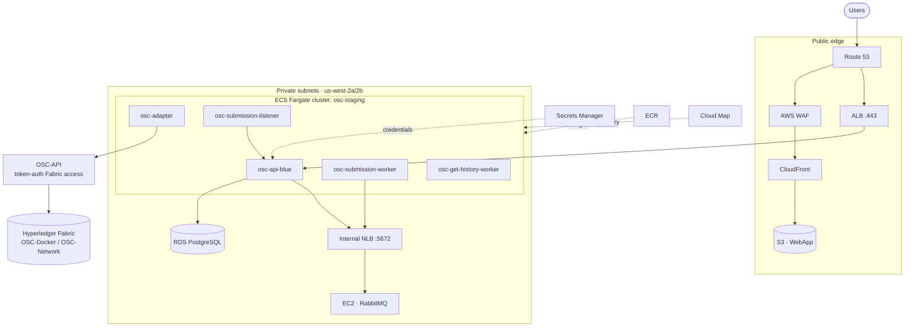

# OSC-IS-Infra

> Infrastructure-as-Code for the Open Science Chain – Information System (OSC-IS): the Terraform configuration and ECS task-definition templates that provision, power-cycle, and tear down the entire AWS staging environment.

This repository is the **operational control plane** for OSC-IS. A single command (`make up` / `make down`) brings the whole platform online or hibernates it to near-zero cost, while protecting the stateful and expensive-to-recreate pieces.

---

## Executive summary

OSC-IS runs on AWS but is a **staging / research** environment that does not need to run 24/7. The dominant design driver of this repository is therefore **cost control without data loss**:

- **`make up`** provisions the load balancers, NAT gateway, and database, starts the message broker, and scales all services to their desired counts — a fully working platform in minutes.
- **`make down`** destroys the *expensive, stateless* resources (ALB, NLB, NAT Gateway, RDS) and stops the broker EC2 instance, collapsing the bill to almost nothing — while **preserving** the cheap, slow-to-recreate resources (ECS services, task definitions, log groups) behind `prevent_destroy` guardrails.
- On the way back up, the database is **restored from the latest snapshot**, so curated blockchain data reappears automatically.

A second, equally important idea: **Terraform owns the infrastructure skeleton; CI/CD owns the container images.** Task definitions are tracked in state for their ARNs but never overwritten by Terraform (`ignore_changes = all`), so the deployment pipeline and the infrastructure lifecycle never fight each other.

---

## What this repository manages

| Layer | Resources |
|---|---|
| **Compute** | ECS Fargate services + task definitions (template-driven), EC2 runtime state for the RabbitMQ broker |
| **Edge / networking** | Application Load Balancer (HTTPS), internal Network Load Balancer (AMQP), NAT Gateway + routes, Route 53 private DNS |
| **Data** | RDS PostgreSQL (snapshot restore), Secrets Manager master credentials |
| **Observability** | CloudWatch log groups (`/ecs/<service>`) |
| **State** | Remote backend in S3 with DynamoDB state locking |

The actual Fabric blockchain network is **not** managed here — it lives in [OSC-Docker](../OSC-Docker) (production) / [OSC-Network](../OSC-Network) (test). OSC-IS reaches it over TLS via [OSC-API](../OSC-API).

---

## Deployment topology



> **Correction to earlier diagrams.** Some legacy architecture diagrams show an S3 bucket of Hyperledger identities mounted into the workers. That was never shipped. Blockchain access is brokered by **OSC-API** with token authentication; the workers hold no Fabric identities.

---

## The two operational modes

| Flag | `up` | `down` |
|---|---|---|
| `runtime_mode` | `up` — ECS desired counts restored, EC2 running | `down` — ECS scaled to 0, EC2 stopped |
| `infra_mode` | `active` — ALB/NLB/NAT/RDS exist | `hibernated` — those resources destroyed |
| `allow_destroy` | `false` | `true` (required safety acknowledgment) |

```bash
# from terraform/
make up        # active + up + no-destroy
make down      # hibernated + down + allow-destroy
make plan-up   # dry run
make plan-down # dry run
make status    # desired counts, EC2 state, endpoints
```

> In environments without `make`, run the equivalent `terraform apply -var ...` directly (see [terraform/README.md](terraform/README.md)). A `power.ps1` PowerShell wrapper is also provided.

---

## Repository layout

```
terraform/
├── main.tf                 # ECS services/task-defs, EC2 runtime state, infra_overrides injection
├── infra_hibernation.tf    # ALB / NLB / NAT / RDS / Route53 (the hibernatable layer)
├── power_variables.tf      # infra_mode / runtime_mode / allow_destroy + ALB/NLB/NAT/RDS objects
├── variables.tf            # services map, networking, cluster, logging
├── outputs.tf              # service ARNs, desired counts, endpoints, secret ARN
├── versions.tf             # provider + S3/DynamoDB backend
├── Makefile                # up / down / status / backup-config / security-check
├── IMPORTS.md              # importing pre-existing ALB/NLB/NAT/RDS into state
└── README.md               # operator reference
task-defs/
└── *.json.tmpl             # ECS task-definition templates (one per service)
```

---

## Configuration & secrets

- **`terraform.tfvars`** is gitignored. It is backed up (AES-256, versioned) to S3 via `make backup-config` and restored with `make restore-config`. `terraform.tfvars.example` is the committed reference.
- **No infrastructure values are hardcoded** in tfvars. Live values (DB host, RDS endpoint for TLS, secret ARNs, RabbitMQ host) are injected into every task-def template at apply time through `local.infra_overrides`.
- **Database credentials** live in a Terraform-managed Secrets Manager secret (`osc/stg/db/master`) with a stable name and ARN across hibernation cycles.

---

## Safety & security gates

- `prevent_destroy = true` on ECS services, task definitions, and log groups.
- `allow_destroy = true` required before any hibernation (destructive) apply.
- `make security-check` runs **tfsec** and **checkov** against the Terraform before bring-up; the CI workflow runs TruffleHog + tfsec as a gate.
- Private subnets for all compute and data; the NLB is internal-only; HTTPS terminates at the ALB; WAF fronts CloudFront.

---

## Documentation

| Document | Contents |
|---|---|
| [docs/ARCHITECTURE.md](docs/ARCHITECTURE.md) | IaC patterns & tactics, the hibernation model, networking, security, and quality-attribute rationale. |
| [terraform/README.md](terraform/README.md) | Operator command reference and mode semantics. |
| [terraform/IMPORTS.md](terraform/IMPORTS.md) | Importing existing AWS resources into Terraform state. |

---

*Part of the OSC-IS platform: [OSC-WebApp](../OSC-WebApp) · [OSC-APIGateway](../OSC-APIGateway) · [OSC-Artifact-Submission](../OSC-Artifact-Submission) · [OSC-API](../OSC-API) · [OSC-Chaincode](../OSC-Chaincode) · [OSC-Docker](../OSC-Docker) · [OSC-Network](../OSC-Network).*
