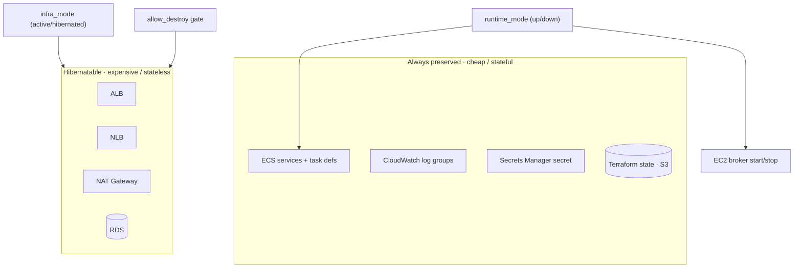
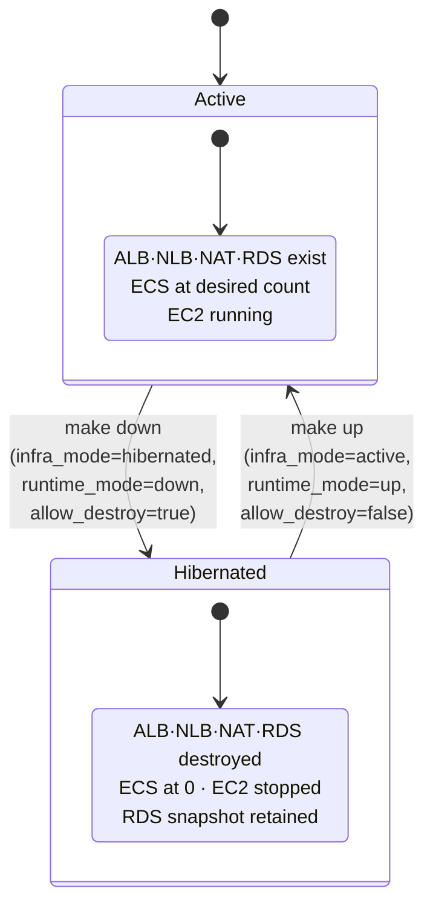
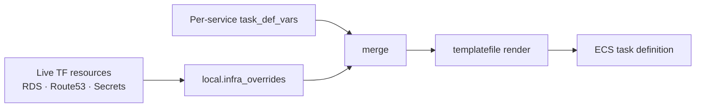

# OSC-IS-Infra — Architecture

This document describes the architecture of the OSC-IS infrastructure-as-code: the **patterns and tactics** used to provision and operate the AWS environment, the **quality attributes** they target, and the **trade-offs** taken.

- [1. Architectural context](#1-architectural-context)
- [2. Prioritized quality attributes](#2-prioritized-quality-attributes)
- [3. Architectural patterns](#3-architectural-patterns)
- [4. Tactics by quality attribute](#4-tactics-by-quality-attribute)
- [5. The hibernation model](#5-the-hibernation-model)
- [6. Configuration injection (no hardcoding)](#6-configuration-injection-no-hardcoding)
- [7. Network & security architecture](#7-network--security-architecture)
- [8. Trade-offs and constraints](#8-trade-offs-and-constraints)

---

## 1. Architectural context

This repository provisions the AWS environment for a **research/staging** deployment of OSC-IS. Unlike a production system that runs continuously, this environment is brought up for demos, testing, and development sessions and then torn down. That single fact reorders the usual infrastructure priorities: **cost-efficiency and safe, repeatable power-cycling** dominate over, say, high availability.

The architecture must reconcile two competing needs:

1. **Spend almost nothing when idle** — destroy the costly resources (load balancers, NAT, managed database).
2. **Never lose data or slow, hand-built configuration** — preserve the database contents, the ECS service definitions, and the message-broker topology across cycles.

The design resolves this tension by **partitioning resources by cost and statefulness**, and toggling only the expendable partition.

---

## 2. Prioritized quality attributes

| # | Quality attribute | Why prioritized | Representative scenario |
|---|---|---|---|
| 1 | **Cost-efficiency** | A staging environment idle most of the time should bill near zero. | After a demo, `make down` destroys ALB/NLB/NAT/RDS; the monthly cost collapses. |
| 2 | **Recoverability / data durability** | Curated blockchain data and service config must survive teardown. | `make up` restores RDS from the latest snapshot; ECS services are preserved by `prevent_destroy`. |
| 3 | **Operability** | One operator must run the whole lifecycle reliably. | `make up` / `make down` / `make status` express the entire operational surface. |
| 4 | **Security** | Credentials and network exposure must be controlled by construction. | Secrets in Secrets Manager; private subnets; internal NLB; pre-apply tfsec/checkov scans. |
| 5 | **Reproducibility** | The environment must rebuild identically from code. | Remote state + locking + templated task defs yield a deterministic apply. |
| 6 | **Separation of concerns** | Infra lifecycle and app deployment must not collide. | `ignore_changes = all` lets CI/CD own container config while Terraform owns the skeleton. |

---

## 3. Architectural patterns

### 3.1 Infrastructure as Code with remote state

All resources are declared in Terraform; state lives in an **S3 backend with DynamoDB locking**, giving reproducibility, drift detection, and safe concurrent operation.

### 3.2 Power-state partitioning (the hibernation pattern)

Resources are split into two classes and controlled by orthogonal flags:

- `runtime_mode` scales ECS to 0 and stops EC2 (reversible, non-destructive).
- `infra_mode` creates or **destroys** the expensive layer (destructive, gated by `allow_destroy`).

### 3.3 Template method (task definitions)

Each service's task definition is a `*.json.tmpl` rendered with `templatefile()`, merging per-service variables with a common set of **infra-derived overrides**. New services are added by dropping in a template — the rendering machinery is shared.

### 3.4 Dependency injection of live infrastructure values

`local.infra_overrides` reads values from *live Terraform resources* (RDS endpoint, private DNS FQDNs, secret ARNs) and injects them into every template at apply time — eliminating hardcoded infrastructure values and the need for a two-pass apply.

### 3.5 Guardrails (prevent_destroy + acknowledgment gate)

`prevent_destroy` lifecycle blocks protect stateful/slow resources; a mandatory `allow_destroy = true` variable acts as a deliberate human acknowledgment before any destructive hibernation.

### 3.6 Ownership boundary between Terraform and CI/CD

Task definitions use `ignore_changes = all`: Terraform tracks their ARNs in state but never rewrites container config. The deployment pipeline pushes new revisions independently. This is a clean **separation of control** that prevents the two systems from reverting each other.

---

## 4. Tactics by quality attribute

### Cost-efficiency

| Tactic | Implementation |
|---|---|
| **Destroy when idle** | `infra_mode=hibernated` deletes ALB/NLB/NAT/RDS — the meaningful cost drivers. |
| **Stop, don't pay** | `runtime_mode=down` scales ECS to 0 and stops the broker EC2 instance. |
| **Keep only the cheap** | Preserved resources (ECS defs, log groups, secret) cost little to retain. |

### Recoverability / durability

| Tactic | Implementation |
|---|---|
| **Restore from snapshot** | `restore_from_latest_snapshot` recreates RDS from the newest snapshot on bring-up. |
| **Stable secret identity** | Master credentials secret keeps a stable name/ARN across cycles. |
| **Protect the irreplaceable** | `prevent_destroy` on services/task-defs/log groups. |
| **Config backup** | `make backup-config` stores gitignored `terraform.tfvars`/`Makefile` to versioned, encrypted S3. |

### Operability

| Tactic | Implementation |
|---|---|
| **One-command lifecycle** | `make up` / `make down` encapsulate the correct flag combinations. |
| **Observable state** | `make status` surfaces desired counts, EC2 state, endpoints, secret ARN. |
| **Dry-run first** | `make plan-up` / `make plan-down`. |

### Security

| Tactic | Implementation |
|---|---|
| **Secrets management** | DB credentials in Secrets Manager; referenced by ARN, never in tfvars. |
| **Network isolation** | Compute/data in private subnets; NLB internal-only; HTTPS at the ALB; WAF on CloudFront. |
| **Shift-left scanning** | `make security-check` (tfsec + checkov); CI gate (TruffleHog + tfsec). |
| **Private DNS** | Route 53 private zone (`osc-infra.local`) for DB/RabbitMQ — never public. |

### Reproducibility / separation of concerns

| Tactic | Implementation |
|---|---|
| **Remote state + locking** | S3 backend + DynamoDB lock table. |
| **Template-driven services** | `*.json.tmpl` + injected overrides. |
| **Lifecycle ownership split** | `ignore_changes = all` on task defs. |

---

## 5. The hibernation model

**Bring-up sequence** (`make up`): recreate NAT/ALB/NLB → restore RDS from snapshot → create private DNS records → scale ECS to desired counts → start EC2 broker. Because `infra_overrides` reads from the freshly created resources, task definitions render with correct values on the first pass.

**Operational caveat:** the RDS endpoint hash changes on snapshot restore, so `db_ssl_servername` (used for TLS CN verification) changes too; the injection mechanism handles this automatically on a full recreate. Message-broker queue bindings are baked into the broker image (see [OSC-Artifact-Submission](../../OSC-Artifact-Submission/docs/messaging-topology.md)).

---

## 6. Configuration injection (no hardcoding)

`infra_overrides` supplies `db_host`, `db_ssl_servername`, `db_password_secret_arn`, `db_user_secret_arn`, and `rabbitmq_host` from live resources. During hibernation those resources are gone and `try(...)` falls back to `""`; because services run at desired_count 0 and task defs use `ignore_changes=all`, the empty values are inert until the next bring-up.

---

## 7. Network & security architecture

| Concern | Design |
|---|---|
| **Ingress (web)** | Route 53 → WAF → CloudFront → S3 (static WebApp). |
| **Ingress (API)** | Route 53 → ALB (HTTPS :443) → ECS `osc-api-blue`. |
| **Internal messaging** | Internal NLB (:5672) → EC2 RabbitMQ; private DNS `rabbitmq.osc-infra.local`. |
| **Database** | RDS in private subnets; private DNS `db.osc-infra.local`; CA-pinned TLS. |
| **Egress** | NAT Gateway for private-subnet outbound (e.g., image pulls, OSC-API calls). |
| **Identity & secrets** | Secrets Manager for DB credentials; IAM task/execution roles per service. |
| **Service discovery** | AWS Cloud Map for inter-service resolution. |

---

## 8. Trade-offs and constraints

| Decision | Benefit | Cost / risk |
|---|---|---|
| Hibernate (destroy) expensive resources | Near-zero idle cost. | Bring-up takes minutes; RDS endpoint changes on restore. |
| Snapshot-restore database | Data survives teardown with no app dependency. | Restores the *latest* snapshot — snapshot hygiene matters. |
| `ignore_changes=all` on task defs | Clean Terraform/CI-CD ownership split. | Terraform won't correct drift in container config — the pipeline must. |
| Single-AZ RDS / minimal redundancy | Cheap, adequate for staging. | Not highly available — acceptable for a non-production environment. |
| `prevent_destroy` guardrails | Protects irreplaceable resources. | Intentional destroys require config changes / targeted operations. |
| Injected infra values via `try()/""` | No hardcoding, hibernation-safe. | Empty fallbacks are only safe because services are at 0 during hibernation. |

---

*See [OSC-Artifact-Submission/docs/messaging-topology.md](../../OSC-Artifact-Submission/docs/messaging-topology.md) for the broker topology that must be present after bring-up, and [OSC-APIGateway/docs/ARCHITECTURE.md](../../OSC-APIGateway/docs/ARCHITECTURE.md) for what runs on this infrastructure.*
