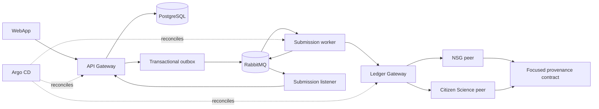

# OSC-IS Current-State Map

Date: 2026-09-01

## Source baseline

The feature work is isolated in a separate worktree for each modified
repository on `feature/usrse26-platform-evidence`. The starting commits preserve
the approved July 31 baseline, subsequent checkpoint commits, and the local
supply-chain-hardening commits.

| Repository | Role | Starting revision | Scope |
|---|---|---:|---|
| OSC-IS-Infra | Terraform, Kubernetes, CI, evidence | `51d27da` | Primary |
| OSC-APIGateway | API, PostgreSQL, auth, outbox | `5b213c9` | Modifiable |
| OSC-Artifact-Submission | workers, listener, Fabric bridge | `7ff82de` | Modifiable |
| OSC-Chaincode | Fabric smart contract | `547058f` | Modifiable |
| OSC-WebApp | browser client | `56429d1` at audit time | Read-only |
| OSC-API | historical VM ledger API | `9d44cdf` at audit time | Protected |
| OSC-Docker | historical composition | audited only | Protected |
| OSC-Network | historical/test Fabric network | audited only | Protected |

The local annotated tag `usrse26-chaincode-legacy-2026-09-01` identifies the
legacy chaincode baseline. It is intentionally not pushed.

## Historical runtime

The historical deployment is a hybrid AWS and external-VM design:

1. The WebApp calls the NestJS API Gateway.
2. The Gateway stores application state in PostgreSQL and writes integration
   events through a transactional outbox.
3. RabbitMQ routes artifact and workflow commands to Python workers.
4. The legacy adapter calls OSC-API on an externally managed Fabric VM.
5. A listener records asynchronous completion back in the Gateway.

This design proved the workflow but made deployment dependent on mutable VMs,
file-based Fabric credentials, manually coordinated services, and an adapter
whose purpose was tied to the old VM boundary.

## Existing strengths

- API Gateway owns application authentication and exposes organization-aware
  routing fields.
- PostgreSQL plus an outbox provides a sound starting point for reliable event
  publication.
- RabbitMQ queues are durable and local integration tests already exercise
  worker and adapter failure.
- A direct Fabric Gateway client exists in the Fabric bridge and has useful unit
  coverage.
- Terraform, GitHub Actions, lockfiles, secure dependency wrappers, vulnerability
  checks, and supply-chain malware detection are already present.
- A pinned Fabric Kubernetes sample deployment exists and creates two peers and
  a three-node Raft ordering service.
- The infrastructure repository already records an approved recovery baseline.

## Verified gaps

### Application identity

- A user has one nullable organization relation and global roles.
- JWT claims contain one organization and global roles.
- The JWT strategy does not revalidate active membership from the database.
- Caller context is not modeled as an active organization membership.
- Organization deletion can cascade into records that should remain auditable.
- Public versus private record visibility is not explicit across every endpoint.

### Ledger boundary

- The deployed path still assumes OSC-API or its compatibility adapter.
- The Fabric bridge permits insecure gRPC configuration, exposes filesystem
  details in health output, and has no authenticated worker-to-bridge boundary.
- The bridge image downloads credentials at container start and runs as root.
- The bridge currently implements artifact operations but not the complete
  workflow provenance surface.

### Chaincode

- The contract combines provenance with application user, group, role, and
  schema administration.
- Application users are represented in ledger state, coupling portal IAM to
  Fabric identity logic.
- The contract surface and key conventions are broad and difficult to reason
  about as one security boundary.
- Tests pass, but formatting debt and the size of the contract make focused
  change risky.

### Messaging

- AWS uses EC2-hosted RabbitMQ in the historical architecture.
- AMQPS trust configuration is not explicit end to end.
- A transient Gateway failure can cause the listener to reject a completion
  without a complete retry and dead-letter policy.
- Queue arguments do not yet define the experimental AWS retry/DLQ contract.

### Kubernetes and GitOps

- Existing EKS Terraform creates a Fabric test cluster against pre-existing
  networking; it does not create the complete disposable environment.
- The full application stack, Amazon MQ, Argo CD, secret delivery, and workload
  identity are not present.
- Fabric deployment uses a pinned upstream sample but is script-driven rather
  than owned by GitOps.
- There is no tested rollout, drift, rollback, or teardown evidence for the full
  product.

## Target experiment

Local Kubernetes uses Kind, an in-cluster RabbitMQ, and generated test-only
secrets. AWS uses a disposable EKS cluster, private Amazon MQ over AMQPS, AWS
Secrets Manager, and short-lived workload identity. The EKS path excludes
OSC-API, mock-osc-api, and the compatibility adapter.

## Baseline validation

At discovery time:

- API Gateway: 13 suites and 214 tests passed; build passed. Formatting and lint
  have substantial pre-existing debt that must not be confused with new defects.
- Fabric bridge: 8 endpoint tests passed; build passed.
- Chaincode: `go test ./...`, `go vet ./...`, and `go mod verify` passed.
- Repository malware scanner and lifecycle suppression fixtures passed in all
  applicable modified repositories.
- No task-created AWS resource existed. Two stopped EC2 RabbitMQ instances, two
  attached EBS volumes, and one ECR repository predated this work and are outside
  task ownership.

